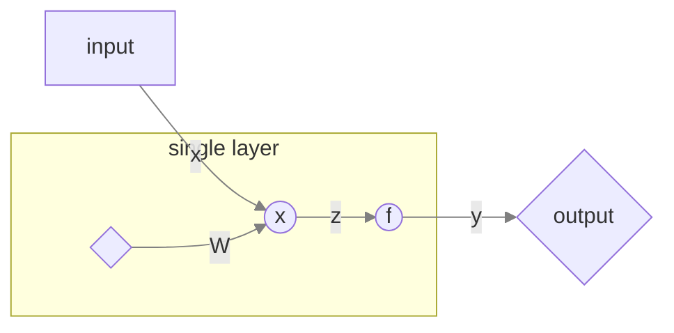

# Feedforward Neural Network Model

>ML Learning Note-4
>The basis of feedforward neural network

## Overview

In this network, the information moves in only one direction, forward, from the input nodes, through the hidden nodes (if any) and to the output nodes.

The submodel between each layers is a Generalized Linear Model. So we can also call feedforward neutral network as `Stacked Generalized Linear Model  `

## Single Layer Unit

