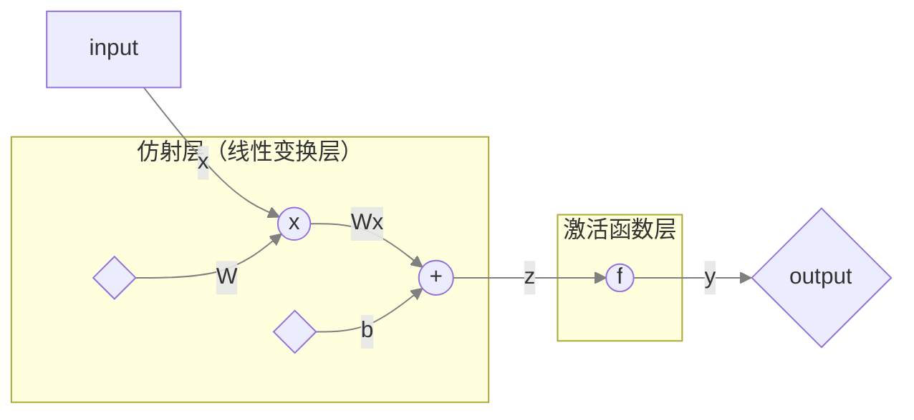
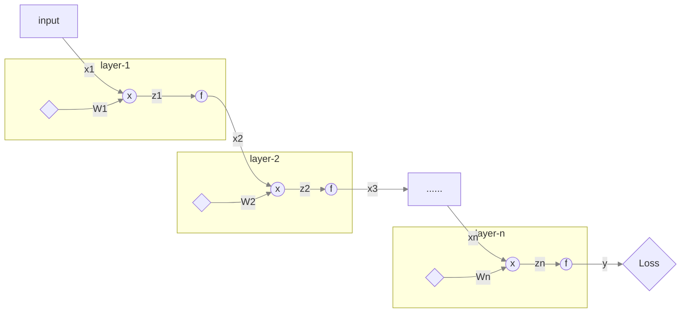

# 前馈神经网络模型

前馈神经网络(feedforward neural network)是一种无反馈连接的人工神经网络，是最简单的人工神经网络模型。

前馈神经网络的本质是广义线性模型的叠加（stacked）

因此我们只需要研究单层前馈网络（single layer）和如何实现计算各层权值的梯度即可

下面我们针对这两个问题进行讲解

## 单层前馈模型

### 符号

| Symbol | Type | Representation |
| ------ | ---- | -------------- |
| $$x$$  | 向量 | 样本特征向量   |
| $$W$$  | 矩阵 | 权值矩阵       |
| $$b$$  | 向量 | bias           |
| $$z$$  | 向量 | $$z=Wx+b$$     |
| $$f$$  | 函数 | 激活函数       |

### 前馈传播

$$
y=f(Wx+b)
$$

### 计算图流

## 多层前馈网络

### 符号

| Symbol      | Type | Representation |
| ----------- | ---- | -------------- |
| $$i$$       | 数   | 第$$i^{th}$$层 |
| $$x_{(i)}$$ | 向量 | 样本特征向量   |
| $$W_{(i)}$$ | 矩阵 | 权值矩阵       |
| $$b_{(i)}$$ | 向量 | bias           |
| $$z_{(i)}$$ | 向量 | $$z=Wx+b$$     |
| $$f_{(i)}$$ | 函数 | 激活函数       |

### 前馈传播

$$
x_{(i+1)}=y_{(i)}=f(W_{(i)}x_{(i)}+b_{(i)})
$$

### 计算图

## 计算权值梯度

我们可以利用反向传播（back propagation）来实现

### 仿射层（线性变换层）

