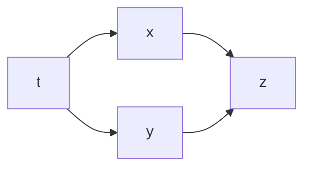
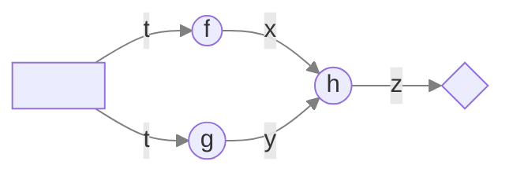
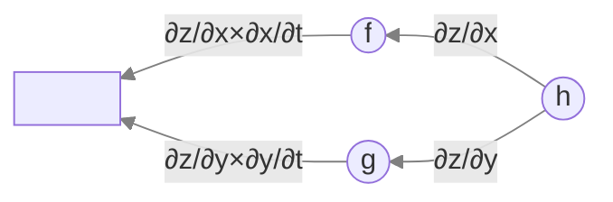
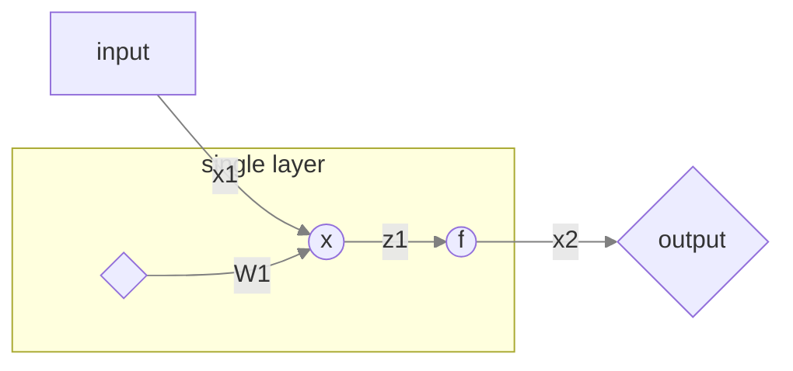
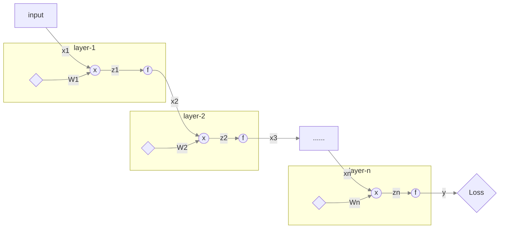
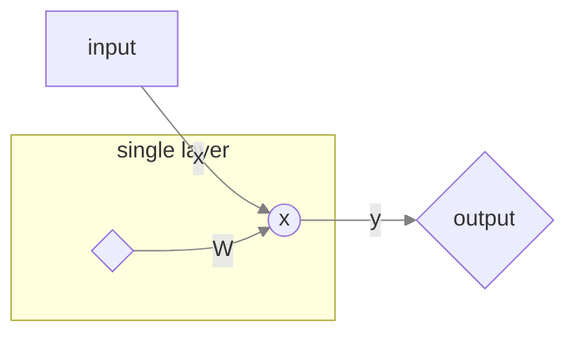

# 链式法则与反向传播

## 前言

在前馈神经网络模型中，反向传播（Back Propagations）是其中重要的优化方法。然而我们大量的教材都是采用的`scale-wise`推导，导致公式复杂，同学们难以理解。本文试图通过`vector-wise`的推导，以更简单的公式形式来更好的表达其中的数学内涵。并进一步揭示链式法则与反向传播之间的关系。

## 链式法则的计算图流表达形式

### 链式法则

`求导链式法则`（derivate chain rule）是微积分中的求导法则，用于求一个复合函数的导数，是在微积分的求导运算中一种常用的方法。

> 具体的定义在这里就不再复述

举一个最简单的例子：

设$z=h(x,y),\begin{cases}x=f(t)\\y=g(t)\end{cases}$,则，
$$
\frac{\partial z}{\partial t}=\frac{\partial z}{\partial x}\frac{\partial x}{\partial t}+\frac{\partial z}{\partial y}\frac{\partial y}{\partial t}
$$
你的高数老师或者数分C老师可能会通过这种图来描述：

### 计算图

我们通过计算流图来描述这个复合多变量函数的计算过程：

图中`箭头`表示变量流向(variable flow)，`圆圈`表示计算单元(compute unit)，`方框`表示输入/输出结点(input/output node)

目前只是表示了计算图流，前馈流(forward flow),现在我们在把反馈流(backward flow)表示出来

> 由于mermaid图的表现能力有限无法渲染数学公式

对应上图，我们可以得到$$\frac{\partial z}{\partial t}$$:
$$
\frac{\partial z}{\partial t}=\frac{\partial z}{\partial x}\frac{\partial x}{\partial t}+\frac{\partial z}{\partial y}\frac{\partial y}{\partial t}
$$
这符合链式法则的表达式。这点说明`链式法则`和`梯度反馈流`本质上是统一原理的不同表现形式，也就是说，原理上，`链式法则`和`梯度反馈流`是等价的。

## 链式法则的向量化表示

> Vectorized Derivate Chain Rule

关于这个内容，你可能在其他的博客文章中见到过类似这样的表格：

| $$\frac{\partial y}{\partial x}$$ | y:标量 | y:向量 | Y:矩阵 |
| --------------------------------- | ------ | ------ | ------ |
| x:标量                            | 标量   | 向量   | 矩阵   |
| x:向量                            | 向量   | 矩阵   |        |
| X:矩阵                            | 矩阵   |        |        |

但其实应该是这样

| $$\frac{\partial y}{\partial x}$$ | y:标量 | y:向量     | Y:矩阵        |
| --------------------------------- | ------ | ---------- | ------------- |
| x:标量                            | 标量   | 向量       | 矩阵          |
| x:向量                            | 向量   | 矩阵       | 张量（3d）    |
| X:矩阵                            | 矩阵   | 张量（3d） | 4维张量（4d） |

> 这里的张量（tensor）指的是广义张量，而不是数学和物理上的狭义张量

### 向量化的求导法则

#### 偏导算子化运算

设$$x\in\mathbb R^n$$是n维向量，则部分算子$$\partial x$$可表示为：
$$
\partial x=\partial
\begin{bmatrix}
x_1\\x_2\\\vdots\\x_n
\end{bmatrix}=
\begin{bmatrix}
\partial x_1\\\partial x_2\\\vdots\\\partial x_n
\end{bmatrix}
$$
设$$x\in\mathbb R^n$$是n维向量，则部分算子$$\frac1{\partial x}$$可表示为：
$$
\frac1{\partial x}=
\begin{bmatrix}
\frac1{\partial x_1}&
\frac1{\partial x_2}&
\cdots&
\frac1{\partial x_n}
\end{bmatrix}
$$
设$$x\in\mathbb R^n$$是n维向量,$$y\in\mathbb R^m$$是m维向量,则偏导数$$\frac{\partial y}{\partial x} $$可通过张量积可得，
$$
\frac{\partial y}{\partial x}=\partial y\frac1{\partial x}=
\begin{bmatrix}
\partial y_1\\\partial y_2\\\vdots\\\partial y_m
\end{bmatrix}
\begin{bmatrix}
\frac1{\partial x_1}&
\frac1{\partial x_2}&
\cdots&
\frac1{\partial x_n}
\end{bmatrix}
=
\begin{bmatrix}
\frac{\partial y_1}{\partial x_1}&\frac{\partial y_1}{\partial x_2}&\cdots&\frac{\partial y_1}{\partial x_n}\\
\frac{\partial y_2}{\partial x_1}&\frac{\partial y_2}{\partial x_2}&\cdots&\frac{\partial y_2}{\partial x_n}\\
\vdots&\vdots&\ddots&\vdots\\
\frac{\partial y_m}{\partial x_1}&\frac{\partial y_m}{\partial x_2}&\cdots&\frac{\partial y_m}{\partial x_n}\\
\end{bmatrix}
$$

> 这就是雅可比矩阵

当$$X\in R^{m\times n}$$是矩阵,$$y\in\mathbb R^l$$是向量时，同理
$$
\frac{\partial y}{\partial X}=\partial y \frac1{\partial X}=
\begin{bmatrix}
\frac{\partial y}{\partial X_{11}}&\frac{\partial y}{\partial X_{12}}&\cdots&\frac{\partial y}{\partial X_{1n}}\\
\frac{\partial y}{\partial X_{21}}&\frac{\partial y}{\partial X_{22}}&\cdots&\frac{\partial y}{\partial X_{2n}}\\
\vdots&\vdots&\ddots&\vdots\\
\frac{\partial y}{\partial X_{m1}}&\frac{\partial y}{\partial X_{m2}}&\cdots&\frac{\partial y}{\partial X_{mn}}\\
\end{bmatrix}
$$
这里$$\frac{\partial y}{\partial X_{ij}}$$是一个向量,嵌入(embed)矩阵中形成3维张量,所以$$\frac{\partial y}{\partial X}\in\mathbb R^{m\times n\times l}$$

> 3维张量在latex中没有很好的渲染方式,所以只能靠想象

#### 求导法则公式形式

可简单表示为
$$
\frac{\partial y}{\partial x}=\partial y\frac1{\partial x}
$$

## 反向传播算法的向量化表示

### 符号

| Symbol | Type | Representation |
| ------ | ---- | -------------- |
| $$x$$  | 向量 | 样本特征向量   |
| $$W$$  | 矩阵 | 权值矩阵       |
| $$z$$  | 向量 | $$z=Wx$$       |
| $$f$$  | 函数 | 激活函数       |

### 网络前馈

$$
x^{(i+1)}=f(z^{(i)})\\
z^{(i)}=W^{(i)}x^{(i)}
$$

### 计算图流表示

#### 一层网络

#### 多层网络

### 计算图流梯度反传

根据图流,我们可以对$$W^{(i)}$$求偏导:
$$
\frac{\partial J}{\partial W^{(i)}}\\
=\frac{\partial J}{\partial y}\frac{\partial y}{\partial z^{(n)}}\frac{\partial z^{(n)}}{\partial W^{(i)}}\\
=\frac{\partial J}{\partial y}\frac{\partial y}{\partial z^{(n)}}\frac{\partial z^{(n)}}{\partial x^{(n)}}\frac{\partial x^{(n)}}{\partial W^{(i)}}\\
=\frac{\partial J}{\partial y}\frac{\partial y}{\partial z^{(n)}}\frac{\partial z^{(n)}}{\partial x^{(n)}}\frac{\partial x^{(n)}}{\partial z^{(n-1)}}\frac{\partial z^{(n-1)}}{\partial W^{(i)}}\\
=\frac{\partial J}{\partial y}\frac{\partial y}{\partial z^{(n)}}\frac{\partial z^{(n)}}{\partial x^{(n)}}\frac{\partial x^{(n)}}{\partial z^{(n-1)}}\frac{\partial z^{(n-1)}}{\partial x^{(n-1)}}\frac{\partial x^{(n-1)}}{\partial W^{(i)}}\\
\vdots
$$

$$
=\frac{\partial J}{\partial y}\frac{\partial y}{\partial z^{(n)}}\frac{\partial z^{(n)}}{\partial x^{(n)}}\frac{\partial x^{(n)}}{\partial z^{(n-1)}}\cdots\frac{\partial x^{(i+1)}}{\partial z^{(i)}}\frac{\partial z^{(i)}}{\partial W^{(i)}}
$$

其中
$$
z^{(i)}=W^{(i)}x^{(i)}\Rightarrow\\\frac{\partial z^{(i)}}{\partial x^{(i)}}=\frac{\partial W^{(i)}x^{(i)}}{\partial x^{(i)}}=W^{(i)}
$$

$$
x^{(i)}=f(z^{(i-1)})\Rightarrow\\\frac{\part x^{(i)}}{\part z^{(i-1)}}=f^{'}(Iz^{(i-1)})
$$

带入即可求解

### 单层模型

#### Linear

##### forward

$$
Y=XW
$$

##### backward

$$
\begin{cases}
\frac{\part L}{\part W}=\frac{\part Y}{\part W}\frac{\part L}{\part Y}
=X^T\frac{\part L}{\part X}\\
\frac{\part L}{\part X}=\frac{\part Y}{\part X}\frac{\part L}{\part Y}
=\frac{\part L}{\part Y}W^T
\end{cases}
$$

